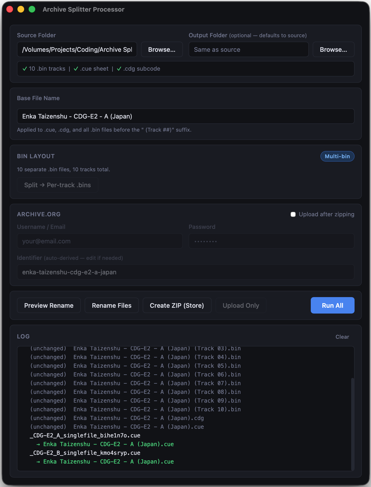

# Archive Splitter Processor

A small macOS desktop app (Tauri + Rust) for preparing CD / CD+G disc rips for
upload to [archive.org](https://archive.org): split a single disc image into
per-track files, verify them against the original redumper logs, rename to a
clean base name, zip, and upload — all from one window.

## What it does

- **Detect layout** — recognizes multi-bin, single-bin multi-track, and raw
  `.img` + `.ccd` (CloneCD) discs.
- **Split** — extracts each track from a single `.bin`/`.img` into per-track
  `.bin` files plus a regenerated per-track `.cue`.
- **Verify** — hashes each split track and checks it against the `<rom>` MD5/size
  entries in the redumper log (plain `.log`, `redumper/`, or inside a `_logs.zip`),
  when one is present.
- **Rename** — applies a base file name (`Title Goes Here (Country)`) to the
  `.cue`, `.cdg`, and all `.bin` files using the redump `(Track ##)` convention.
- **Zip (Store)** — bundles the renamed files into an uncompressed `.zip`.
- **Upload** — pushes the zip to archive.org via the `ia` CLI, with live progress.

**Run All** chains these steps: split → verify → rename → zip → upload (the split
and verify steps are skipped when the disc isn't a single-file image, and the
pipeline aborts before upload if verification fails).

Thanks to https://github.com/putnam/binmerge for referential logic.
